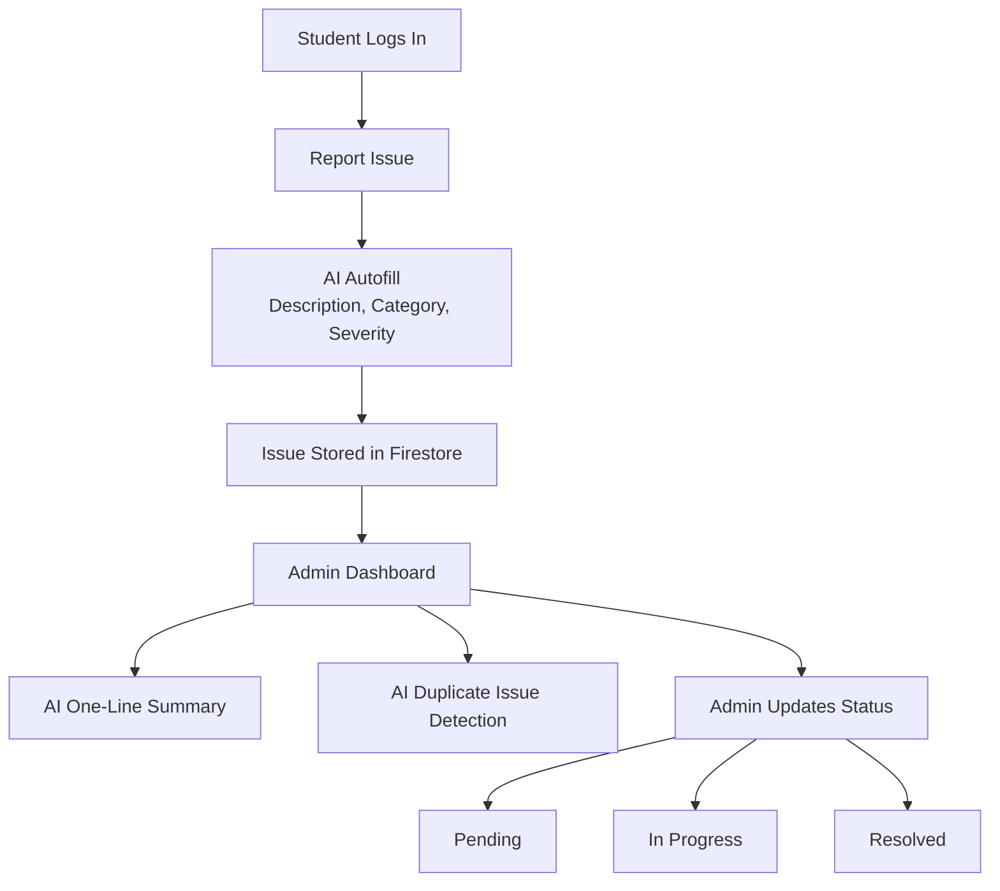

<h1 align="center">🏫 Campus Issue Reporting System</h1>

  <b>AI-Powered • Role-Based • Hackathon Prototype</b>

  An intelligent campus issue reporting platform that streamlines communication between students and administrators using AI-assisted automation.

<h2>🚀 Highlights</h2>
<ul>
  <li>🤖 AI-assisted issue reporting</li>
  <li>🔐 Role-based access (Student / Admin)</li>
  <li>📊 Admin dashboard with smart insights</li>
  <li>🧠 Duplicate issue detection</li>
  <li>📉 Controlled AI usage with clear math</li>
</ul>

<h2>❓ Problem Statement</h2>

Campus issues like broken projectors, infrastructure failures, or network outages are often reported informally,
leading to delays, duplicate complaints, and lack of accountability.

This project introduces a <b>centralized, AI-powered system</b> to report, track, and resolve campus issues efficiently.

<h2>🔄 System Workflow</h2>

<h2>🎓 Student Side Features</h2>
<ul>
  <li>🔐 Secure authentication</li>
  <li>📝 Issue reporting with validation</li>
  <li>🤖 AI-powered autofill (description, category, severity)</li>
  <li>📋 Dashboard with issue tracking</li>
</ul>

<h2>🛠️ Admin Side Features</h2>
<ul>
  <li>🔑 Role-based admin access</li>
  <li>🔍 Search, filter, and sort issues</li>
  <li>🤖 AI one-line summaries</li>
  <li>⚠️ AI duplicate unresolved issue detection</li>
  <li>📁 Resolved issues separated</li>
</ul>

<h2>🤖 AI Features Implemented</h2>

<h3>1️⃣ AI Autofill (Student)</h3>
<ul>
  <li>Auto-generates description</li>
  <li>Predicts category</li>
  <li>Assigns severity</li>
</ul>

<h3>2️⃣ AI One-Line Summary (Admin)</h3>

Generates a concise summary to help admins quickly understand issues.

<h3>3️⃣ AI Duplicate Issue Detection (Admin)</h3>

Detects whether a newly reported issue is similar to existing unresolved issues.

<h2>📐 AI Request Consumption (Math)</h2>

Each issue can trigger at most:

<ul>
  <li>1 AI call → Autofill (Student)</li>
  <li>1 AI call → Summary (Admin)</li>
  <li>1 AI call → Duplicate Detection (Admin)</li>
</ul>

<pre>
Let I = number of issues per day

Total AI Requests per Day (RPD) = I × 3
</pre>

<b>Example:</b>

<pre>
5 issues/day → 15 AI requests/day
</pre>

All AI calls are explicit, optional, and controlled to stay within free-tier limits.

<h2>🧱 Tech Stack</h2>

<h3>🎨 Frontend</h3>
<ul>
  <li>⚛️ React (Vite)</li>
  <li>🎨 Tailwind CSS</li>
  <li>🔗 Axios</li>
</ul>

<h3>🧠 AI</h3>
<ul>
  <li>🤖 Google Gemini AI</li>
</ul>

<h3>🔧 Backend</h3>
<ul>
  <li>🐍 Flask (Python)</li>
  <li>🔐 Firebase Authentication</li>
  <li>📡 REST APIs</li>
</ul>

<h3>🗄️ Database</h3>
<ul>
  <li>🔥 Firebase Firestore</li>
</ul>

<h2>👥 Collaborators</h2>
<ul>
  <li>👨‍💻 Author 1 – <i>Ritankar Bose</i></li>
  <li>👩‍💻 Author 2 – <i>Rani Bhattacharjee</i></li>
</ul>

Built with teamwork, curiosity, and late-night debugging ☕

<h2>📜 License</h2>

This project is developed for educational and hackathon purposes.

<h2>🌟 Final Note</h2>

This is not just a demo — it is a thoughtfully designed system with responsible AI usage,
clear workflows, and real-world scalability.

